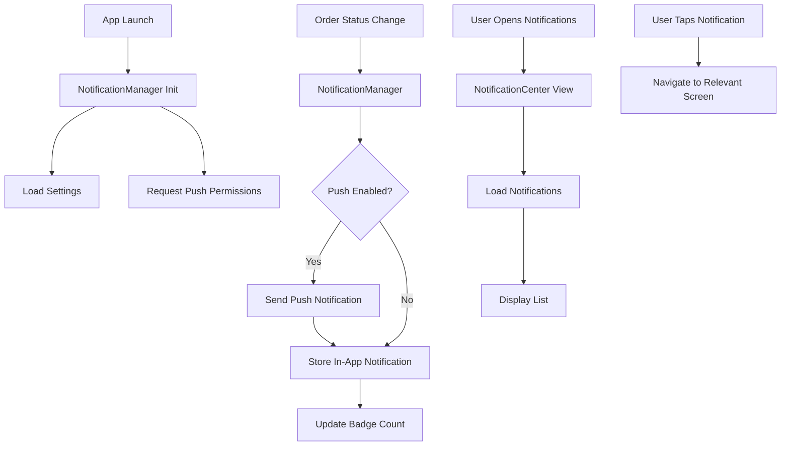

# Design Document

## Overview

Система уведомлений для Quick Mart представляет собой комплексное решение для управления и доставки уведомлений пользователям. Система включает в себя локальные уведомления внутри приложения, push-уведомления, управление настройками и персонализацию контента. Архитектура построена на принципах MVVM с использованием SwiftUI и Combine framework для реактивного программирования.

## Architecture

### High-Level Architecture

```
┌─────────────────┐    ┌──────────────────┐    ┌─────────────────┐
│   UI Layer      │    │  Business Logic  │    │  Data Layer     │
│                 │    │                  │    │                 │
│ NotificationView│◄──►│NotificationManager│◄──►│ Persistence     │
│ SettingsView    │    │SettingsManager   │    │ UserDefaults    │
│ NotificationCard│    │ PushManager      │    │ CoreData (opt)  │
└─────────────────┘    └──────────────────┘    └─────────────────┘
         │                       │                       │
         ▼                       ▼                       ▼
┌─────────────────┐    ┌──────────────────┐    ┌─────────────────┐
│ SwiftUI Views   │    │ ObservableObject │    │ Local Storage   │
│ Combine         │    │ Combine          │    │ JSON/Codable    │
└─────────────────┘    └──────────────────┘    └─────────────────┘
```

### Component Interaction Flow



## Components and Interfaces

### 1. NotificationManager (Core Business Logic)

```swift
class NotificationManager: ObservableObject {
    @Published var notifications: [AppNotification] = []
    @Published var unreadCount: Int = 0
    @Published var settings: NotificationSettings
    
    // Core Methods
    func sendNotification(_ notification: AppNotification)
    func markAsRead(_ notificationId: UUID)
    func deleteNotification(_ notificationId: UUID)
    func clearAllNotifications()
    
    // Category-specific methods
    func sendOrderNotification(_ order: Order, status: OrderStatus)
    func sendPromoNotification(_ promo: PromoNotification)
    func sendStockNotification(_ product: Product)
}
```

### 2. PushNotificationManager (Push Notifications)

```swift
class PushNotificationManager: NSObject, ObservableObject {
    @Published var isAuthorized: Bool = false
    @Published var authorizationStatus: UNAuthorizationStatus = .notDetermined
    
    func requestPermission()
    func sendLocalNotification(_ notification: AppNotification)
    func handleNotificationResponse(_ response: UNNotificationResponse)
    func updateBadgeCount(_ count: Int)
}
```

### 3. NotificationSettings (User Preferences)

```swift
struct NotificationSettings: Codable {
    var orderUpdates: Bool = true
    var promotions: Bool = true
    var stockAlerts: Bool = true
    var deliveryUpdates: Bool = true
    var quietHoursEnabled: Bool = false
    var quietHoursStart: Date = Date()
    var quietHoursEnd: Date = Date()
    var pushEnabled: Bool = false
}
```

### 4. UI Components

#### NotificationCenterView
- Главный экран уведомлений
- Список всех уведомлений с фильтрацией
- Поддержка pull-to-refresh
- Индикаторы прочитанных/непрочитанных уведомлений

#### NotificationCard
- Компонент для отображения отдельного уведомления
- Поддержка различных типов контента
- Действия: прочитать, удалить, перейти

#### NotificationSettingsView
- Настройки категорий уведомлений
- Управление тихими часами
- Настройки push-уведомлений

#### NotificationBadge
- Индикатор количества непрочитанных уведомлений
- Интеграция с TabView

## Data Models

### AppNotification

```swift
struct AppNotification: Identifiable, Codable {
    let id: UUID
    let title: String
    let body: String
    let category: NotificationCategory
    let timestamp: Date
    var isRead: Bool
    let actionData: NotificationActionData?
    let imageURL: String?
    let priority: NotificationPriority
    
    enum NotificationCategory: String, CaseIterable, Codable {
        case orderUpdate = "order_update"
        case promotion = "promotion"
        case stockAlert = "stock_alert"
        case delivery = "delivery"
        case system = "system"
    }
    
    enum NotificationPriority: String, Codable {
        case low, normal, high, critical
    }
}
```

### NotificationActionData

```swift
struct NotificationActionData: Codable {
    let actionType: ActionType
    let targetId: String?
    let additionalData: [String: String]?
    
    enum ActionType: String, Codable {
        case openOrder = "open_order"
        case openProduct = "open_product"
        case openPromo = "open_promo"
        case openCart = "open_cart"
        case openProfile = "open_profile"
    }
}
```

### PromoNotification

```swift
struct PromoNotification: Codable {
    let title: String
    let description: String
    let discountPercentage: Int?
    let validUntil: Date
    let targetCategories: [ProductCategory]
    let imageURL: String?
    let promoCode: String?
}
```

## Error Handling

### NotificationError

```swift
enum NotificationError: Error, LocalizedError {
    case permissionDenied
    case networkError(String)
    case persistenceError(String)
    case invalidNotificationData
    case quotaExceeded
    case systemError(String)
    
    var errorDescription: String? {
        switch self {
        case .permissionDenied:
            return "Notification permission denied"
        case .networkError(let message):
            return "Network error: \(message)"
        case .persistenceError(let message):
            return "Storage error: \(message)"
        case .invalidNotificationData:
            return "Invalid notification data"
        case .quotaExceeded:
            return "Notification quota exceeded"
        case .systemError(let message):
            return "System error: \(message)"
        }
    }
}
```

### Error Recovery Strategies

1. **Permission Denied**: Показать объяснение важности уведомлений и предложить перейти в настройки
2. **Network Errors**: Сохранить уведомления локально для повторной отправки
3. **Storage Errors**: Очистить старые уведомления и повторить операцию
4. **Quota Exceeded**: Автоматически удалить старые уведомления

## Testing Strategy

### Unit Tests

1. **NotificationManager Tests**
   - Создание и отправка уведомлений
   - Управление состоянием прочитанных/непрочитанных
   - Фильтрация по категориям
   - Настройки пользователя

2. **PushNotificationManager Tests**
   - Запрос разрешений
   - Отправка локальных уведомлений
   - Обработка ответов пользователя
   - Управление badge count

3. **Data Model Tests**
   - Сериализация/десериализация
   - Валидация данных
   - Обработка edge cases

### Integration Tests

1. **End-to-End Notification Flow**
   - От создания заказа до получения уведомления
   - Интеграция с существующими компонентами
   - Навигация по уведомлениям

2. **Settings Integration**
   - Применение пользовательских настроек
   - Синхронизация между компонентами
   - Персистентность настроек

### UI Tests

1. **NotificationCenter UI**
   - Отображение списка уведомлений
   - Взаимодействие с уведомлениями
   - Навигация и переходы

2. **Settings UI**
   - Изменение настроек
   - Валидация пользовательского ввода
   - Сохранение изменений

## Performance Considerations

### Memory Management
- Ограничение количества уведомлений в памяти (максимум 100)
- Lazy loading для старых уведомлений
- Автоматическая очистка уведомлений старше 30 дней

### Battery Optimization
- Группировка уведомлений для снижения частоты обновлений
- Использование тихих часов для предотвращения ночных уведомлений
- Оптимизация частоты проверки новых уведомлений

### Network Efficiency
- Кэширование изображений для уведомлений
- Batch-отправка аналитических данных
- Сжатие данных уведомлений

## Security Considerations

### Data Privacy
- Шифрование персональных данных в уведомлениях
- Минимизация данных в push-уведомлениях
- Соблюдение GDPR для европейских пользователей

### Permission Management
- Graceful degradation при отсутствии разрешений
- Четкое объяснение необходимости разрешений
- Возможность работы без push-уведомлений

## Integration Points

### Existing App Components

1. **MainTabView Integration**
   - Добавление badge для уведомлений
   - Интеграция NotificationManager в environment

2. **Order System Integration**
   - Автоматические уведомления при изменении статуса заказа
   - Интеграция с OrdersView для навигации

3. **Cart Integration**
   - Уведомления о забытых товарах в корзине
   - Напоминания о скидках на товары в корзине

4. **Favorites Integration**
   - Уведомления о скидках на избранные товары
   - Уведомления о поступлении товаров

### External Services (Future)
- Push notification service (APNs)
- Analytics service для отслеживания эффективности
- A/B testing для оптимизации контента уведомлений

## Accessibility

### VoiceOver Support
- Правильные accessibility labels для всех элементов
- Поддержка navigation с помощью VoiceOver
- Озвучивание важности уведомлений

### Dynamic Type
- Поддержка различных размеров шрифтов
- Адаптивная верстка для больших шрифтов
- Сохранение читаемости при любом размере

### Color Contrast
- Соответствие WCAG guidelines
- Поддержка высококонтрастных тем
- Альтернативы для цветовых индикаторов

## Localization

### Multi-language Support
- Поддержка локализации всех текстов уведомлений
- Форматирование дат и времени согласно локали
- Поддержка RTL языков

### Content Adaptation
- Адаптация длины текста для разных языков
- Культурно-адаптированные изображения и иконки
- Локализованные форматы валют и чисел